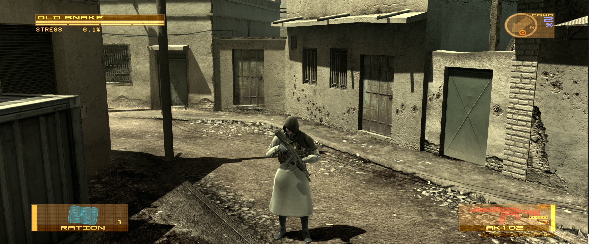
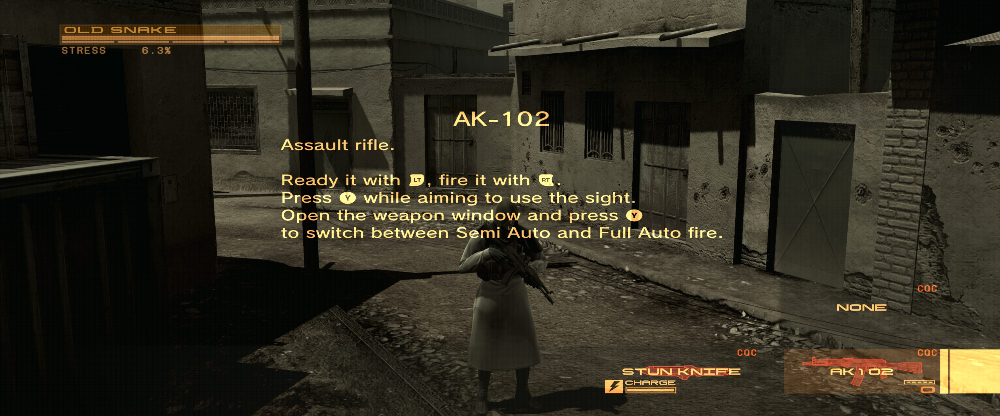

# MGS4 Ultra120

Open-source ultrawide, FOV and controller-profile fixes for the Steam PC port
of *METAL GEAR SOLID 4*, with corrected 120 FPS support on Windows through
[cipherxof/MGSFPSUnlock](https://github.com/cipherxof/MGSFPSUnlock).

> **Public alpha.** `v0.3.3-alpha.1` targets the verified Steam executable.
> Other builds are blocked unless the user accepts the unsafe override. Back up
> saves and keep Steam's game files available for verification.

> **Recommended unified release.** Windows and Linux now share the validated
> native-camera FOV implementation. Optional supersampling remains experimental
> and disabled by default.

## What the Windows release installs

| Component | Purpose |
|---|---|
| `winmm.dll` | Pinned Ultimate ASI Loader v9.7.4 |
| `scripts/MGS4Ultra120.asi` | Ultrawide/Hor+, FOV and controller-profile fixes |
| `mgs4_ultrawide.ini` | Shared MGS4Ultra120 settings |
| `scripts/MGSFPSUnlock.asi` | Corrected high-frame-rate implementation by cipherxof |
| `scripts/MGSFPSUnlock.ini` | Persistent FPS target; defaults to 120 |

Our old single-value FPS override is disabled and no longer writes the game's
FPS state. MGSFPSUnlock owns frame-rate timing and supplies separate fixes for
camera movement, character control, polygon demos, physics, ragdolls, cloth,
hair/bandana, wind and SPURS tasks. This avoids two plugins fighting over the
same setting.

MGSFPSUnlock is an independent source-published project. Because its repository
currently does not declare a redistribution license, its binary is **not
repackaged** in our downloads. Guided setup downloads version 0.1.0 directly
from its official GitHub release, requires the pinned archive and ASI SHA-256
values to match, and installs only its ASI and INI. Thank you to
[cipherxof](https://github.com/cipherxof) for the substantially improved FPS
unlock implementation.

## Rendering status

- 3440x1440 real-time 3D rendering is validated as correctly proportioned and
  Hor+ rather than a stretched 16:9 image.
- `FOVMultiplier=1.200` is the tested 21:9 recommendation and supported
  maximum under the corrected single-owner model. `1.000` preserves the
  original vertical FOV but frames Snake more tightly in the tested view.
- Native FOV is still experimental. Disable it independently in the
  configurator if a new stability or scene-specific issue appears; Hor+ remains
  active with the original vertical FOV.
- The unfinished UI/safe-area experiment is not part of the release binary.
  Menus, HUD and full-screen effects retain the game's original behavior.
- Pre-rendered Bink video is unchanged.
- FOV is applied once to the native camera-builder input. The game then creates
  its own projection, combined matrices and frustum planes from that corrected
  input; the final renderer hook changes aspect only. This avoids both the old
  render/culling mismatch and the withdrawn alpha.6 double transformation.
- Native Windows validation at 3440x1440 completed with native mode active, no
  fallback, natural object proportions, an undistorted WeaponWindow and clean
  problematic cinematics. The public range ends at `1.200`.
- Native FOV remains experimental. For maximum stability, leave it disabled;
  when enabled at 21:9, do not exceed the tested `1.200` recommendation.
- Native 3440x1440 testing has correct proportions and a working aiming
  crosshair. Experimental supersampling tests isolate a separate
  internal-width boundary: the reticle is stable at 3956x1656, flickers at
  exactly 4096 pixels wide and can disappear according to aiming depth above
  it. Alpha.6 warns users to keep internal width below 4096.

## Validation screenshots

Captured during the final `v0.3.3-alpha.1` Windows validation at 3440x1440 with
`FOVMultiplier=1.200`.

**Gameplay**



**WeaponWindow**



## Windows downloads

Use the
[v0.3.3-alpha.1 release](https://github.com/drbermejor/mgs4Ultra120/releases/tag/v0.3.3-alpha.1)
and choose one package:

1. **Setup EXE** — guided Steam detection, configuration, shortcuts and safe
   uninstall. It requires internet access once to fetch the verified
   MGSFPSUnlock 0.1.0 package.
2. **Portable ZIP** — extract it, then run `MGS4Ultra120-Setup.cmd`. It provides
   the same guided installation without registering a persistent application.
3. **Manual ZIP** — the most transparent copy-only route. It runs no script,
   but corrected 120 FPS requires two additional files from the official
   MGSFPSUnlock 0.1.0 ZIP; see the short instructions below.
4. **Complete ZIP** — portable setup, manual folder, source-facing notices and
   all documentation in one archive.

The EXE is unsigned, so SmartScreen or a browser may show an
unknown-publisher/reputation warning. The EXE is optional. Download only from
the official release and keep antivirus enabled. All project code and build
instructions are public and can be reviewed or built independently.

Optional supersampling is included in the same release, remains disabled by
default and is intended only for users who explicitly want to render above
their physical output resolution. See
[experimental supersampling](docs/EXPERIMENTAL_SUPERSAMPLING.md).

### Brief manual installation

Remove old MGS4 Ultra120 builds first; do not retain another Ultimate ASI Loader
proxy or a renamed old project ASI. Close the game, extract the manual ZIP and copy its contents into the folder
that directly contains `mgs4.exe`:

```text
MGS4\winmm.dll
MGS4\mgs4_ultrawide.ini
MGS4\scripts\MGS4Ultra120.asi
```

For corrected 120 FPS, download
[MGSFPSUnlock 0.1.0](https://github.com/cipherxof/MGSFPSUnlock/releases/tag/0.1.0),
open its ZIP and copy only these two files into the same `MGS4\scripts` folder:

```text
MGSFPSUnlock\scripts\MGSFPSUnlock.asi
MGSFPSUnlock\scripts\MGSFPSUnlock.ini
```

Do **not** copy its `d3d11.dll`, `winhttp.dll` or `wininet.dll`; our package
already provides the required ASI loader. Confirm that its INI contains
`TargetFrameRate = 120`, then launch normally through Steam. The manual ZIP
does not install the optional launcher bypass; choose the game language in the
official Unity launcher. The `Language=` INI setting controls only the optional
wrapper installed by guided setup.

See [Windows installation](docs/INSTALL_WINDOWS.md) and
[manual installation](docs/MANUAL_INI.md) for backup and removal details.

## Windows defaults and known display issue

The configurator selects the primary monitor's physical resolution, native-size
windowed presentation, FOV 1.200, corrected 120 FPS, controller-profile fix and
Unity-launcher bypass. Exclusive fullscreen is an advanced option.

On one mixed-refresh NVIDIA multi-monitor system, focus changes produced a red
sweep/flicker and Windows display WATCHDOG reports. Testing was clean after
G-SYNC/VRR was disabled, but that is not a universal diagnosis. The
configurator warns and never changes driver or Windows display settings. See
[Windows troubleshooting](docs/TROUBLESHOOTING_WINDOWS.md).

## Linux / Proton

The `v0.3.3-alpha.1` Linux package uses the same architecture as Windows:
pinned Ultimate ASI Loader plus separate `MGS4Ultra120.asi` and optional
`MGSFPSUnlock.asi` plugins. Easy Setup downloads MGSFPSUnlock 0.1.0 from its
official release, verifies its hashes and applies the Wine `PAGE_WRITECOPY`
compatibility byte locally; its unlicensed binary is never redistributed.

The Linux GUI configures resolution, FOV, ultrawide, supersampling, 30/60/120
FPS, controller-profile correction, launcher bypass and native/Gamescope
fullscreen. Easy Setup creates a persistent configurator shortcut on the
desktop and in the application menu. GE-Proton10-34, DX12, 3440x1440 Hor+ with 3956x1656 internal
supersampling, all FPS timing hooks and a true 3440x1440 Gamescope client were
validated. See [Linux installation](docs/INSTALL_LINUX.md) and
[corrected FPS on Proton](docs/PROTON_FPS.md).

## Technical outline

MGS4Ultra120 adjusts the native camera input scale before the game builds its
dependent projection and visibility state:

```text
adjusted_camera_scale = original_camera_scale / FOVMultiplier
new_m00 = sign(m00) * abs(native_m11) / target_aspect
```

The withdrawn alpha.6 candidate edited already-built matrices and reconstructed
camera/frustum state after return, causing an additional transformation. The
new path changes only the original scalar input. The game remains the sole
owner of its matrices and frustum planes, while the common renderer setter is
an aspect-only safety net in native mode.

The patch never edits `mgs4.exe`. The optional direct-launch wrapper backs up
`Launcher/launcher.exe`, reproduces the official launcher's child-process
command line, and restores the original only when ownership hashes still match.

Further reading:

- [Configuration](docs/CONFIGURATION.md)
- [Experimental supersampling](docs/EXPERIMENTAL_SUPERSAMPLING.md)
- [Controller profile fix](docs/CONTROLLER_FIX.md)
- [Direct-launch wrapper](docs/LAUNCHER_WRAPPER.md)
- [UI and video status](docs/UI_AND_VIDEO.md)
- [Technical notes](docs/TECHNICAL.md)
- [Development and reproducible builds](docs/DEVELOPMENT.md)

MGS4 Ultra120 is MIT-licensed. Third-party components retain their own terms;
see [third-party notices](THIRD_PARTY_NOTICES.md). No game files are included.
This project is not affiliated with or endorsed by KONAMI.
