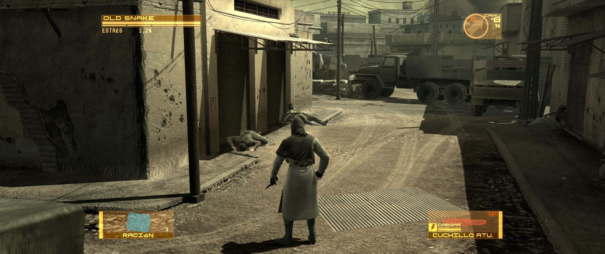
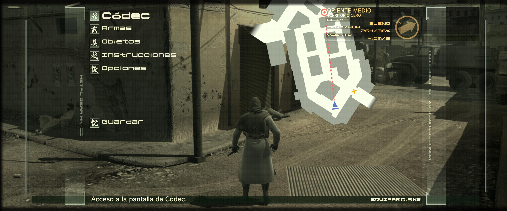

# Experimental centered 16:9 HUD

This optional DX12-only companion attempts to keep accepted HUD draws inside a
centered 16:9 safe area on ultrawide output. It is included on Windows and
Linux/Proton but disabled by default.

> **Known-broken development preview:** keep this option disabled for normal
> play. Current testing found misplaced or overflowing menu text, incorrectly
> scaled maps, displaced 3D weapon/item previews and intermittent layout
> flicker. Subtitles, Codec, save/load and less common menus are not complete.
> `Enabled=0` is the supported fallback.

`v0.3.4-alpha.4` replaces the earlier per-draw correction with one coherent UI
batch transform. This keeps text, frames, panels and subtitles in the same
centered coordinate system and removes the stretch/shrink pulse seen in older
builds. The tested weapon and item 3D previews are fitted separately without
changing their FOV or projection. Do not combine this HUD ASI with files from
an older package.

Use the **Experimental centered 16:9 HUD** switch in either configurator. For a
manual installation, close the game and edit:

```ini
; mgs4_centered_hud_16x9.ini
[Lab]
Enabled=1
```

Set `Enabled=0` to return to the normal HUD. The companion ASI may stay in the
`scripts` folder: while disabled, it exits before installing D3D12 hooks and
does not alter FOV, resolution, input, FPS or launcher behavior.

The complete 2D path rejects positively identified fullscreen effects. The 3D
preview fit is deliberately limited to the visually validated weapon/item
layout; a broader render-target rule remains private until Codec, scope,
backpack and unusual item screens have been captured. Gameplay, load and weapon
screens plus AK-102 and knife previews were validated at 3440x1440 on Windows.
The wider validation campaign found significant failures beyond those initial
screens, so the feature is not currently suitable for a normal playthrough. If
you deliberately test it, close the game and disable the option before
reporting the affected screen and resolution.

The transform cache has a fixed memory budget. If it is ever exhausted, the
companion records the event in `mgs4_centered_hud_16x9.log` and disables its HUD
correction for the remainder of that game run rather than mixing corrected and
uncorrected elements.

The separate high-internal-resolution crosshair overflow is corrected by the
core `MGS4Ultra120.asi`; it does not depend on this HUD experiment.

## Screenshots

The following ultrawide captures show the experimental 16:9 safe area in
gameplay and in the tested pause-menu layout. Only the HUD is centered; the 3D
scene continues to cover the full ultrawide output.




